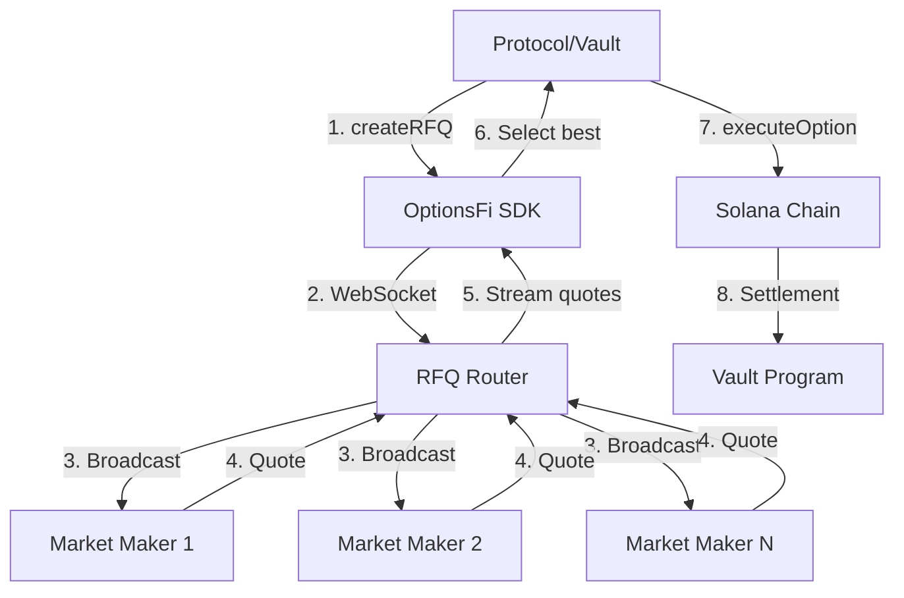

# OptionsFi Week 1-2 PRD: SDK & Documentation Launch

## Overview

**Goal**: Transform the OptionsFi RFQ infrastructure from a single-vault implementation into a reusable SDK that any protocol can integrate in under 30 minutes.

**Timeline**: 14 days (2 sprints)
**Team**: 2-3 engineers
**Success Metrics**: 
- 3+ GitHub stars
- 1+ external developer successfully integrates
- SDK published to NPM with <1 hour setup time

---

## Problem Statement

Currently, OptionsFi's RFQ infrastructure is tightly coupled to the reference vault implementation. A protocol wanting to use your options settlement layer would need to:

1. Clone your entire repo
2. Understand your vault architecture
3. Extract and adapt the RFQ logic
4. Figure out integration patterns through code archaeology
5. Set up their own keeper infrastructure

**This takes weeks. It should take 30 minutes.**

---

## Solution Architecture

### Component Breakdown

```
┌─────────────────────────────────────────────────────────────┐
│                    CURRENT STATE                            │
│  ┌────────────────────────────────────────────────────┐    │
│  │  Monolithic Vault Repo                             │    │
│  │  ├── Vault Program (Anchor)                        │    │
│  │  ├── RFQ Router (infra/rfq-router/)                │    │
│  │  ├── Keeper (infra/keeper/)                        │    │
│  │  ├── Frontend (app/)                               │    │
│  │  └── Scripts (scripts/)                            │    │
│  └────────────────────────────────────────────────────┘    │
└─────────────────────────────────────────────────────────────┘

                            ↓ TRANSFORM TO ↓

┌─────────────────────────────────────────────────────────────┐
│                    TARGET STATE                             │
│                                                             │
│  ┌──────────────────────────────────────────────────┐      │
│  │  @optionsfi/sdk (NPM Package)                    │      │
│  │  ├── RFQ Client                                  │      │
│  │  │   ├── createRFQ()                             │      │
│  │  │   ├── subscribeToQuotes()                     │      │
│  │  │   ├── executeOption()                         │      │
│  │  │   └── cancelRFQ()                             │      │
│  │  ├── Types                                        │      │
│  │  │   ├── RFQRequest                              │      │
│  │  │   ├── Quote                                    │      │
│  │  │   └── OptionParams                            │      │
│  │  └── Utils                                        │      │
│  │      ├── calculatePremium()                       │      │
│  │      └── validateQuote()                         │      │
│  └──────────────────────────────────────────────────┘      │
│                                                             │
│  ┌──────────────────────────────────────────────────┐      │
│  │  Documentation Site (docs.optionsfi.xyz)         │      │
│  │  ├── Quickstart Guide                            │      │
│  │  ├── API Reference                               │      │
│  │  ├── Integration Examples                        │      │
│  │  └── Architecture Diagrams                       │      │
│  └──────────────────────────────────────────────────┘      │
│                                                             │
│  ┌──────────────────────────────────────────────────┐      │
│  │  Demo Playground (optionsfi.xyz/playground)      │      │
│  │  ├── Interactive RFQ Creator                     │      │
│  │  ├── Live Quote Monitor                          │      │
│  │  └── Execution Simulator                         │      │
│  └──────────────────────────────────────────────────┘      │
│                                                             │
│  ┌──────────────────────────────────────────────────┐      │
│  │  Reference Vault (GitHub Template)               │      │
│  │  ├── Example integration                         │      │
│  │  ├── "Fork this" button                          │      │
│  │  └── Step-by-step comments                       │      │
│  └──────────────────────────────────────────────────┘      │
└─────────────────────────────────────────────────────────────┘
```

---

## Day-by-Day Sprint Plan

### Days 1-3: SDK Extraction & Packaging

#### Day 1: Code Extraction

**Objective**: Identify and extract reusable RFQ logic from current codebase

**Tasks**:

1. **Audit Current Codebase**
   - [ ] Review `infra/rfq-router/index.js` - identify client-side logic vs server logic
   - [ ] Review `infra/keeper/` - identify what external protocols need vs internal automation
   - [ ] Review `programs/vault/src/lib.rs` - identify on-chain instructions other vaults will call
   - [ ] List all functions a third-party vault would need

2. **Create SDK Package Structure**
   ```
   packages/sdk/
   ├── src/
   │   ├── client/
   │   │   ├── RFQClient.ts          # Main SDK class
   │   │   ├── WebSocketManager.ts   # Handle WS connections
   │   │   └── TransactionBuilder.ts # Build Solana transactions
   │   ├── types/
   │   │   ├── rfq.ts                # RFQRequest, Quote types
   │   │   ├── option.ts             # OptionParams, Strike, Expiry
   │   │   └── vault.ts              # Vault account structure
   │   ├── utils/
   │   │   ├── pricing.ts            # Black-Scholes helpers
   │   │   ├── validation.ts         # Input validation
   │   │   └── formatting.ts         # Format amounts, dates
   │   ├── constants/
   │   │   ├── addresses.ts          # Program IDs, known addresses
   │   │   └── config.ts             # Default configs
   │   └── index.ts                  # Main export
   ├── tests/
   │   ├── rfq.test.ts
   │   └── validation.test.ts
   ├── package.json
   ├── tsconfig.json
   ├── README.md
   └── .npmignore
   ```

3. **Extract Core Functions**
   
   Based on your current code, extract these key functions:

   **From `infra/rfq-router/index.js`**:
   ```typescript
   // Current implementation (pseudo-code from your repo):
   // Server receives RFQ → broadcasts to MMs → collects quotes → returns best
   
   // SDK should provide:
   class RFQClient {
     constructor(config: RFQConfig);
     async createRFQ(params: RFQParams): Promise<string>; // Returns RFQ ID
     async subscribeToQuotes(rfqId: string, callback: (quote: Quote) => void);
     async executeOption(rfqId: string, quoteId: string): Promise<Transaction>;
     async cancelRFQ(rfqId: string): Promise<void>;
   }
   ```

   **From `infra/keeper/`**:
   ```typescript
   // Your keeper currently:
   // - Fetches prices from Pyth
   // - Calculates strikes and expiries
   // - Creates RFQs
   // - Triggers settlement
   
   // SDK should expose utilities:
   export class OptionPricingHelper {
     static calculateFairValue(params: OptionParams): number;
     static suggestStrike(spotPrice: number, deltaBps: number): number;
     static calculateEpochExpiry(epochStartTime: number, durationDays: number): number;
   }
   ```

   **From `programs/vault/src/lib.rs`**:
   ```typescript
   // Your on-chain program has these instructions:
   // - initialize_vault
   // - deposit
   // - request_withdrawal
   // - record_notional_exposure
   // - advance_epoch
   // - collect_premium
   // - pay_settlement
   
   // SDK should wrap these:
   export class VaultInstructions {
     static async recordNotionalExposure(params: {
       vault: PublicKey,
       premiumAmount: number,
       strikePrice: number,
       // ...
     }): Promise<TransactionInstruction>;
     
     static async collectPremium(params: {
       vault: PublicKey,
       marketMaker: PublicKey,
       amount: number
     }): Promise<TransactionInstruction>;
   }
   ```

**Deliverables**:
- [ ] SDK folder structure created
- [ ] Core types defined in TypeScript
- [ ] 3 main classes stubbed out (RFQClient, OptionPricingHelper, VaultInstructions)

---

#### Day 2: Core SDK Implementation

**Objective**: Implement the main RFQClient class with full functionality

**Implementation**:

```typescript
// packages/sdk/src/client/RFQClient.ts

import { Connection, PublicKey, Transaction } from '@solana/web3.js';
import WebSocket from 'ws';

export interface RFQConfig {
  rpcUrl: string;
  rfqRouterUrl: string; // Your WS server: wss://rfq.optionsfi.xyz
  programId: string;    // Your vault program ID
  network?: 'devnet' | 'mainnet-beta';
}

export interface RFQParams {
  asset: string;           // "SOL", "NVDAX", etc.
  side: 'buy' | 'sell';    // Protocol buying or selling options
  optionType: 'call' | 'put';
  strike: number;
  expiry: number;          // Unix timestamp
  quantity: number;        // Notional amount
  vaultAddress: string;    // The vault making the request
}

export interface Quote {
  id: string;
  marketMaker: string;
  premium: number;         // Premium amount in USDC
  timestamp: number;
  expiresAt: number;
}

export class RFQClient {
  private connection: Connection;
  private wsConnection: WebSocket | null = null;
  private config: RFQConfig;
  private quoteCallbacks: Map<string, (quote: Quote) => void> = new Map();

  constructor(config: RFQConfig) {
    this.config = config;
    this.connection = new Connection(config.rpcUrl, 'confirmed');
  }

  /**
   * Connect to the RFQ router WebSocket
   */
  async connect(): Promise<void> {
    return new Promise((resolve, reject) => {
      this.wsConnection = new WebSocket(this.config.rfqRouterUrl);
      
      this.wsConnection.on('open', () => {
        console.log('Connected to OptionsFi RFQ Router');
        resolve();
      });

      this.wsConnection.on('message', (data: string) => {
        this.handleMessage(JSON.parse(data));
      });

      this.wsConnection.on('error', (error) => {
        console.error('WebSocket error:', error);
        reject(error);
      });
    });
  }

  /**
   * Create a new RFQ and broadcast to market makers
   */
  async createRFQ(params: RFQParams): Promise<string> {
    if (!this.wsConnection) {
      throw new Error('Not connected. Call connect() first.');
    }

    // Validate parameters
    this.validateRFQParams(params);

    // Generate RFQ ID
    const rfqId = this.generateRFQId();

    // Send to RFQ router
    const message = {
      type: 'create_rfq',
      id: rfqId,
      params: {
        ...params,
        timestamp: Date.now(),
      }
    };

    this.wsConnection.send(JSON.stringify(message));

    return rfqId;
  }

  /**
   * Subscribe to quotes for a specific RFQ
   */
  async subscribeToQuotes(
    rfqId: string, 
    callback: (quote: Quote) => void
  ): Promise<void> {
    this.quoteCallbacks.set(rfqId, callback);

    // Request quotes from router
    if (this.wsConnection) {
      this.wsConnection.send(JSON.stringify({
        type: 'subscribe_quotes',
        rfqId
      }));
    }
  }

  /**
   * Execute option with the chosen quote
   */
  async executeOption(
    rfqId: string,
    quoteId: string,
    wallet: any // Solana wallet adapter
  ): Promise<string> {
    // 1. Notify RFQ router of acceptance
    if (this.wsConnection) {
      this.wsConnection.send(JSON.stringify({
        type: 'accept_quote',
        rfqId,
        quoteId
      }));
    }

    // 2. Build on-chain transaction
    // This calls your vault program's record_notional_exposure instruction
    const tx = await this.buildExecutionTransaction(rfqId, quoteId);
    
    // 3. Sign and send
    const signedTx = await wallet.signTransaction(tx);
    const signature = await this.connection.sendRawTransaction(
      signedTx.serialize()
    );
    
    await this.connection.confirmTransaction(signature);
    
    return signature;
  }

  /**
   * Cancel an RFQ before execution
   */
  async cancelRFQ(rfqId: string): Promise<void> {
    if (!this.wsConnection) {
      throw new Error('Not connected');
    }

    this.wsConnection.send(JSON.stringify({
      type: 'cancel_rfq',
      rfqId
    }));

    // Clean up callbacks
    this.quoteCallbacks.delete(rfqId);
  }

  // Private helper methods

  private handleMessage(message: any): void {
    if (message.type === 'quote') {
      const callback = this.quoteCallbacks.get(message.rfqId);
      if (callback) {
        callback(message.quote);
      }
    } else if (message.type === 'rfq_filled') {
      console.log(`RFQ ${message.rfqId} filled by ${message.marketMaker}`);
    }
  }

  private validateRFQParams(params: RFQParams): void {
    if (params.quantity <= 0) {
      throw new Error('Quantity must be positive');
    }
    if (params.strike <= 0) {
      throw new Error('Strike must be positive');
    }
    if (params.expiry <= Date.now() / 1000) {
      throw new Error('Expiry must be in the future');
    }
    // Add more validation as needed
  }

  private generateRFQId(): string {
    return `rfq_${Date.now()}_${Math.random().toString(36).substr(2, 9)}`;
  }

  private async buildExecutionTransaction(
    rfqId: string, 
    quoteId: string
  ): Promise<Transaction> {
    // TODO: Build actual Solana transaction calling your vault program
    // This needs to interact with your Anchor program
    throw new Error('Not implemented - to be completed with Anchor integration');
  }
}
```

**Tasks**:
- [ ] Implement RFQClient class with all methods
- [ ] Add input validation for all parameters
- [ ] Add error handling for network issues
- [ ] Write unit tests for validation logic

**Deliverables**:
- [ ] Working RFQClient class
- [ ] TypeScript types exported
- [ ] Basic test coverage

---

#### Day 3: Anchor Program Integration & Utils

**Objective**: Connect SDK to your on-chain Anchor program

**Implementation**:

```typescript
// packages/sdk/src/client/VaultInstructions.ts

import * as anchor from '@coral-xyz/anchor';
import { PublicKey, TransactionInstruction } from '@solana/web3.js';
import { Program } from '@coral-xyz/anchor';
import idl from './vault_idl.json'; // Your vault program IDL

export interface RecordExposureParams {
  vault: PublicKey;
  authority: PublicKey;
  marketMaker: PublicKey;
  premiumAmount: number;
  notionalAmount: number;
  strikePrice: number;
  expiryTimestamp: number;
  optionType: 'call' | 'put';
}

export class VaultInstructions {
  private program: Program;

  constructor(
    connection: anchor.web3.Connection,
    programId: PublicKey
  ) {
    const provider = new anchor.AnchorProvider(
      connection,
      {} as any, // Wallet not needed for instruction building
      { commitment: 'confirmed' }
    );
    
    this.program = new Program(idl as any, programId, provider);
  }

  /**
   * Build instruction to record option exposure after RFQ execution
   */
  async recordNotionalExposure(
    params: RecordExposureParams
  ): Promise<TransactionInstruction> {
    return await this.program.methods
      .recordNotionalExposure(
        new anchor.BN(params.premiumAmount),
        new anchor.BN(params.notionalAmount),
        new anchor.BN(params.strikePrice),
        new anchor.BN(params.expiryTimestamp),
        params.optionType === 'call' ? { call: {} } : { put: {} }
      )
      .accounts({
        vault: params.vault,
        authority: params.authority,
        marketMaker: params.marketMaker,
      })
      .instruction();
  }

  /**
   * Build instruction to collect premium from market maker
   */
  async collectPremium(params: {
    vault: PublicKey;
    authority: PublicKey;
    marketMaker: PublicKey;
    premiumAmount: number;
  }): Promise<TransactionInstruction> {
    return await this.program.methods
      .collectPremium(new anchor.BN(params.premiumAmount))
      .accounts({
        vault: params.vault,
        authority: params.authority,
        marketMaker: params.marketMaker,
        // Add token accounts as needed
      })
      .instruction();
  }
}
```

**Pricing Utilities**:

```typescript
// packages/sdk/src/utils/pricing.ts

/**
 * Black-Scholes pricing utilities
 * Based on your keeper's pricing logic
 */

interface OptionParams {
  spot: number;      // Current asset price
  strike: number;    // Strike price
  timeToExpiry: number; // Years until expiry
  volatility: number;   // Annualized volatility (e.g., 0.80 for 80%)
  riskFreeRate?: number; // Default to 0.03 (3%)
  optionType: 'call' | 'put';
}

export class OptionPricing {
  /**
   * Calculate Black-Scholes fair value
   */
  static calculateFairValue(params: OptionParams): number {
    const { spot, strike, timeToExpiry, volatility, optionType } = params;
    const r = params.riskFreeRate || 0.03;
    
    // Prevent division by zero
    if (timeToExpiry <= 0) return 0;
    if (volatility <= 0) return Math.max(0, spot - strike);

    const d1 = this.calculateD1(spot, strike, timeToExpiry, volatility, r);
    const d2 = d1 - volatility * Math.sqrt(timeToExpiry);
    
    if (optionType === 'call') {
      return spot * this.normalCDF(d1) - 
             strike * Math.exp(-r * timeToExpiry) * this.normalCDF(d2);
    } else {
      return strike * Math.exp(-r * timeToExpiry) * this.normalCDF(-d2) - 
             spot * this.normalCDF(-d1);
    }
  }

  /**
   * Calculate d1 for Black-Scholes
   */
  private static calculateD1(
    spot: number,
    strike: number,
    t: number,
    vol: number,
    r: number
  ): number {
    return (Math.log(spot / strike) + (r + (vol ** 2) / 2) * t) / 
           (vol * Math.sqrt(t));
  }

  /**
   * Cumulative normal distribution function
   */
  private static normalCDF(x: number): number {
    const t = 1 / (1 + 0.2316419 * Math.abs(x));
    const d = 0.3989423 * Math.exp(-x * x / 2);
    const p = d * t * (0.3193815 + t * (-0.3565638 + t * (1.781478 + 
                 t * (-1.821256 + t * 1.330274))));
    return x > 0 ? 1 - p : p;
  }

  /**
   * Suggest strike price based on spot and delta
   */
  static suggestStrike(spotPrice: number, deltaBps: number): number {
    // deltaBps = 1000 means 10% OTM
    // For calls: strike = spot * (1 + delta/10000)
    // For puts: strike = spot * (1 - delta/10000)
    return spotPrice * (1 + deltaBps / 10000);
  }

  /**
   * Calculate time to expiry in years
   */
  static timeToExpiry(expiryTimestamp: number): number {
    const now = Date.now() / 1000;
    const secondsToExpiry = expiryTimestamp - now;
    return secondsToExpiry / (365.25 * 24 * 60 * 60);
  }

  /**
   * Validate quote is within reasonable bounds
   * Returns true if quote is within maxDeviationBps of fair value
   */
  static validateQuote(
    quotePremium: number,
    fairValue: number,
    maxDeviationBps: number = 500 // Default 5%
  ): { isValid: boolean; reason?: string } {
    const deviation = Math.abs(quotePremium - fairValue) / fairValue;
    const maxDeviation = maxDeviationBps / 10000;

    if (deviation > maxDeviation) {
      return {
        isValid: false,
        reason: `Quote deviates ${(deviation * 100).toFixed(2)}% from fair value (max: ${(maxDeviation * 100).toFixed(2)}%)`
      };
    }

    return { isValid: true };
  }
}
```

**Tasks**:
- [ ] Copy vault IDL to SDK package
- [ ] Implement VaultInstructions class
- [ ] Implement OptionPricing utility class
- [ ] Add validation helpers
- [ ] Write tests for pricing calculations

**Deliverables**:
- [ ] SDK can build transactions for your vault program
- [ ] Pricing utilities match your keeper's logic
- [ ] All functions have JSDoc comments

---

### Days 4-7: Documentation Site

#### Day 4: Documentation Infrastructure

**Objective**: Set up documentation site with Mintlify

**Setup**:

```bash
# Install Mintlify CLI
npm i -g mintlify

# Create docs directory
mkdir docs
cd docs
mintlify init

# Project structure
docs/
├── mint.json              # Configuration
├── introduction.mdx       # Landing page
├── quickstart.mdx         # 5-minute integration
├── api-reference/
│   ├── rfq-client.mdx
│   ├── vault-instructions.mdx
│   └── pricing-utils.mdx
├── guides/
│   ├── creating-rfqs.mdx
│   ├── handling-quotes.mdx
│   ├── executing-options.mdx
│   └── error-handling.mdx
├── examples/
│   ├── basic-vault.mdx
│   ├── custom-strategies.mdx
│   └── advanced-integration.mdx
└── architecture.mdx
```

**Configuration** (`mint.json`):

```json
{
  "name": "OptionsFi",
  "logo": {
    "light": "/logo/light.svg",
    "dark": "/logo/dark.svg"
  },
  "favicon": "/favicon.png",
  "colors": {
    "primary": "#0D9373",
    "light": "#07C983",
    "dark": "#0D9373"
  },
  "topbarLinks": [
    {
      "name": "GitHub",
      "url": "https://github.com/feeniks01/optionsfi"
    }
  ],
  "topbarCtaButton": {
    "name": "Get Started",
    "url": "https://optionsfi.xyz/playground"
  },
  "navigation": [
    {
      "group": "Getting Started",
      "pages": ["introduction", "quickstart"]
    },
    {
      "group": "API Reference",
      "pages": [
        "api-reference/rfq-client",
        "api-reference/vault-instructions",
        "api-reference/pricing-utils"
      ]
    },
    {
      "group": "Guides",
      "pages": [
        "guides/creating-rfqs",
        "guides/handling-quotes",
        "guides/executing-options",
        "guides/error-handling"
      ]
    },
    {
      "group": "Examples",
      "pages": [
        "examples/basic-vault",
        "examples/custom-strategies",
        "examples/advanced-integration"
      ]
    },
    {
      "group": "Architecture",
      "pages": ["architecture"]
    }
  ]
}
```

**Tasks**:
- [ ] Install and configure Mintlify
- [ ] Set up docs folder structure
- [ ] Configure mint.json with branding
- [ ] Deploy to docs.optionsfi.xyz (or subdomain)

---

#### Day 5-6: Write Core Documentation

**Content to Create**:

1. **Introduction Page** (`introduction.mdx`):

```mdx
---
title: Introduction
description: 'OptionsFi: On-Chain Options Settlement Infrastructure'
---

## What is OptionsFi?

OptionsFi is the settlement and pricing layer for on-chain options. We connect DeFi protocols to professional market makers via RFQs (Request for Quote), enabling:

- **Real options premiums** from professional MMs
- **Deterministic on-chain execution** with no slippage
- **Modular infrastructure** that works with any vault strategy
- **Transparent pricing** with on-chain reference prices

## Use Cases

<CardGroup cols={2}>
  <Card
    title="Covered Call Vaults"
    icon="chart-line"
    href="/examples/basic-vault"
  >
    Earn premium by selling calls on deposited assets
  </Card>
  <Card
    title="Put-Selling Strategies"
    icon="shield"
    href="/examples/custom-strategies"
  >
    Generate yield by selling cash-secured puts
  </Card>
  <Card
    title="Custom Structured Products"
    icon="rocket"
    href="/guides/advanced-integration"
  >
    Build collars, spreads, and exotic payoffs
  </Card>
  <Card
    title="Treasury Management"
    icon="building-columns"
    href="/guides/dao-integration"
  >
    Optimize DAO treasury yield with options
  </Card>
</CardGroup>

## How It Works

1. **Your vault** calls `createRFQ()` with option parameters
2. **Market makers** submit competitive quotes
3. **Your vault** selects best quote and executes on-chain
4. **Settlement** happens automatically at expiry

## Quick Example

```typescript
import { RFQClient } from '@optionsfi/sdk';

const client = new RFQClient({
  rpcUrl: 'https://api.devnet.solana.com',
  rfqRouterUrl: 'wss://rfq.optionsfi.xyz',
  programId: 'A4jgqct3bwTwRmHECHdPpbH3a8ksaVb7rny9pMUGFo94'
});

// Create RFQ for covered call
const rfqId = await client.createRFQ({
  asset: 'SOL',
  side: 'sell',
  optionType: 'call',
  strike: 200,
  expiry: Math.floor(Date.now() / 1000) + 7 * 24 * 60 * 60, // 7 days
  quantity: 100,
  vaultAddress: 'your-vault-address'
});

// Subscribe to quotes
client.subscribeToQuotes(rfqId, (quote) => {
  console.log(`Quote from ${quote.marketMaker}: ${quote.premium} USDC`);
  
  // Execute best quote
  if (quote.premium > minAcceptablePremium) {
    await client.executeOption(rfqId, quote.id, wallet);
  }
});
```

## Next Steps

<CardGroup cols={2}>
  <Card
    title="Quickstart"
    icon="play"
    href="/quickstart"
  >
    Integrate OptionsFi in under 30 minutes
  </Card>
  <Card
    title="API Reference"
    icon="code"
    href="/api-reference/rfq-client"
  >
    Explore the full SDK documentation
  </Card>
</CardGroup>
```

2. **Quickstart Guide** (`quickstart.mdx`):

```mdx
---
title: 'Quickstart'
description: 'Integrate OptionsFi in under 30 minutes'
---

## Prerequisites

- Node.js 18+
- Solana wallet with devnet SOL
- Basic Solana/Anchor knowledge

## Step 1: Install SDK

<CodeGroup>

```bash npm
npm install @optionsfi/sdk @solana/web3.js @coral-xyz/anchor
```

```bash yarn
yarn add @optionsfi/sdk @solana/web3.js @coral-xyz/anchor
```

```bash pnpm
pnpm add @optionsfi/sdk @solana/web3.js @coral-xyz/anchor
```

</CodeGroup>

## Step 2: Initialize Client

Create a new file `rfq-example.ts`:

```typescript
import { RFQClient } from '@optionsfi/sdk';
import { Connection } from '@solana/web3.js';

const client = new RFQClient({
  rpcUrl: 'https://api.devnet.solana.com',
  rfqRouterUrl: 'wss://rfq-devnet.optionsfi.xyz',
  programId: 'A4jgqct3bwTwRmHECHdPpbH3a8ksaVb7rny9pMUGFo94',
  network: 'devnet'
});

await client.connect();
console.log('Connected to OptionsFi!');
```

## Step 3: Create Your First RFQ

```typescript
// Calculate option parameters
import { OptionPricing } from '@optionsfi/sdk';

const spotPrice = 180; // Current SOL price
const strike = OptionPricing.suggestStrike(spotPrice, 1000); // 10% OTM

// Create RFQ
const rfqId = await client.createRFQ({
  asset: 'SOL',
  side: 'sell',
  optionType: 'call',
  strike: strike,
  expiry: Math.floor(Date.now() / 1000) + 7 * 24 * 60 * 60, // 7 days
  quantity: 100, // 100 SOL
  vaultAddress: 'your-vault-public-key'
});

console.log(`RFQ created: ${rfqId}`);
```

## Step 4: Handle Quotes

```typescript
// Subscribe to incoming quotes
let bestQuote = null;

client.subscribeToQuotes(rfqId, (quote) => {
  console.log(`Quote received from ${quote.marketMaker}:`);
  console.log(`  Premium: ${quote.premium} USDC`);
  console.log(`  Expires: ${new Date(quote.expiresAt)}`);
  
  // Track best quote
  if (!bestQuote || quote.premium > bestQuote.premium) {
    bestQuote = quote;
  }
});

// Wait for quotes (in real implementation, use proper async handling)
await new Promise(resolve => setTimeout(resolve, 5000));
```

## Step 5: Execute Option

```typescript
import { useWallet } from '@solana/wallet-adapter-react';

// In your React component
const wallet = useWallet();

if (bestQuote) {
  const signature = await client.executeOption(
    rfqId,
    bestQuote.id,
    wallet
  );
  
  console.log(`Option executed! Signature: ${signature}`);
  console.log(`View on Solscan: https://solscan.io/tx/${signature}?cluster=devnet`);
}
```

## Complete Example

Here's a full working example:

```typescript
import { RFQClient, OptionPricing } from '@optionsfi/sdk';

async function main() {
  // 1. Setup
  const client = new RFQClient({
    rpcUrl: 'https://api.devnet.solana.com',
    rfqRouterUrl: 'wss://rfq-devnet.optionsfi.xyz',
    programId: 'A4jgqct3bwTwRmHECHdPpbH3a8ksaVb7rny9pMUGFo94',
    network: 'devnet'
  });
  
  await client.connect();
  
  // 2. Calculate parameters
  const spotPrice = 180;
  const strike = OptionPricing.suggestStrike(spotPrice, 1000);
  const expiry = Math.floor(Date.now() / 1000) + 7 * 24 * 60 * 60;
  
  // 3. Create RFQ
  const rfqId = await client.createRFQ({
    asset: 'SOL',
    side: 'sell',
    optionType: 'call',
    strike,
    expiry,
    quantity: 100,
    vaultAddress: 'your-vault-address'
  });
  
  // 4. Collect quotes
  const quotes = [];
  client.subscribeToQuotes(rfqId, (quote) => {
    quotes.push(quote);
  });
  
  await new Promise(resolve => setTimeout(resolve, 5000));
  
  // 5. Select and execute best quote
  if (quotes.length > 0) {
    const bestQuote = quotes.reduce((best, curr) => 
      curr.premium > best.premium ? curr : best
    );
    
    console.log(`Executing best quote: ${bestQuote.premium} USDC premium`);
    // await client.executeOption(rfqId, bestQuote.id, wallet);
  }
}

main().catch(console.error);
```

## Next Steps

<CardGroup cols={2}>
  <Card
    title="API Reference"
    icon="book"
    href="/api-reference/rfq-client"
  >
    Explore all available methods
  </Card>
  <Card
    title="Build a Vault"
    icon="building"
    href="/examples/basic-vault"
  >
    Create a full covered call vault
  </Card>
  <Card
    title="Handle Errors"
    icon="triangle-exclamation"
    href="/guides/error-handling"
  >
    Production-ready error handling
  </Card>
  <Card
    title="Advanced Features"
    icon="rocket"
    href="/guides/advanced-integration"
  >
    Custom strategies and optimizations
  </Card>
</CardGroup>
```

3. **API Reference** (`api-reference/rfq-client.mdx`):

```mdx
---
title: 'RFQClient'
description: 'Core SDK class for creating and managing RFQs'
---

## Constructor

```typescript
new RFQClient(config: RFQConfig)
```

<ParamField path="config" type="RFQConfig" required>
  Configuration object for the RFQ client

  <Expandable title="RFQConfig properties">
    <ParamField path="rpcUrl" type="string" required>
      Solana RPC endpoint URL
    </ParamField>
    <ParamField path="rfqRouterUrl" type="string" required>
      OptionsFi WebSocket RFQ router URL
    </ParamField>
    <ParamField path="programId" type="string" required>
      OptionsFi vault program ID
    </ParamField>
    <ParamField path="network" type="'devnet' | 'mainnet-beta'" default="devnet">
      Solana network to use
    </ParamField>
  </Expandable>
</ParamField>

### Example

```typescript
const client = new RFQClient({
  rpcUrl: 'https://api.devnet.solana.com',
  rfqRouterUrl: 'wss://rfq-devnet.optionsfi.xyz',
  programId: 'A4jgqct3bwTwRmHECHdPpbH3a8ksaVb7rny9pMUGFo94',
  network: 'devnet'
});
```

---

## Methods

### connect()

Establish WebSocket connection to the RFQ router.

```typescript
await client.connect(): Promise<void>
```

**Returns**: Promise that resolves when connection is established

**Throws**: Connection error if unable to connect

### Example

```typescript
try {
  await client.connect();
  console.log('Connected successfully');
} catch (error) {
  console.error('Connection failed:', error);
}
```

---

### createRFQ()

Create a new RFQ and broadcast to market makers.

```typescript
await client.createRFQ(params: RFQParams): Promise<string>
```

<ParamField path="params" type="RFQParams" required>
  RFQ parameters

  <Expandable title="RFQParams properties">
    <ParamField path="asset" type="string" required>
      Asset symbol (e.g., "SOL", "BTC", "NVDAX")
    </ParamField>
    <ParamField path="side" type="'buy' | 'sell'" required>
      Whether protocol is buying or selling the option
    </ParamField>
    <ParamField path="optionType" type="'call' | 'put'" required>
      Type of option
    </ParamField>
    <ParamField path="strike" type="number" required>
      Strike price in USD
    </ParamField>
    <ParamField path="expiry" type="number" required>
      Expiry timestamp (Unix seconds)
    </ParamField>
    <ParamField path="quantity" type="number" required>
      Notional quantity in base asset units
    </ParamField>
    <ParamField path="vaultAddress" type="string" required>
      Public key of the vault making the request
    </ParamField>
  </Expandable>
</ParamField>

**Returns**: RFQ ID (string)

**Throws**: 
- ValidationError if parameters are invalid
- ConnectionError if not connected

### Example

```typescript
const rfqId = await client.createRFQ({
  asset: 'SOL',
  side: 'sell',
  optionType: 'call',
  strike: 200,
  expiry: Math.floor(Date.now() / 1000) + 604800, // 7 days
  quantity: 100,
  vaultAddress: 'HcEBPRoD...'
});
```

---

### subscribeToQuotes()

Subscribe to quotes for a specific RFQ.

```typescript
await client.subscribeToQuotes(
  rfqId: string,
  callback: (quote: Quote) => void
): Promise<void>
```

<ParamField path="rfqId" type="string" required>
  RFQ ID returned from createRFQ()
</ParamField>

<ParamField path="callback" type="(quote: Quote) => void" required>
  Function called for each incoming quote

  <Expandable title="Quote properties">
    <ParamField path="id" type="string">
      Unique quote identifier
    </ParamField>
    <ParamField path="marketMaker" type="string">
      Market maker's public key
    </ParamField>
    <ParamField path="premium" type="number">
      Premium amount in USDC
    </ParamField>
    <ParamField path="timestamp" type="number">
      Quote creation time (Unix ms)
    </ParamField>
    <ParamField path="expiresAt" type="number">
      Quote expiry time (Unix ms)
    </ParamField>
  </Expandable>
</ParamField>

### Example

```typescript
const quotes = [];

await client.subscribeToQuotes(rfqId, (quote) => {
  console.log(`New quote: ${quote.premium} USDC`);
  quotes.push(quote);
  
  // Auto-execute if premium exceeds threshold
  if (quote.premium > 1.5) {
    client.executeOption(rfqId, quote.id, wallet);
  }
});
```

---

### executeOption()

Execute an option with the selected quote.

```typescript
await client.executeOption(
  rfqId: string,
  quoteId: string,
  wallet: WalletContextState
): Promise<string>
```

<ParamField path="rfqId" type="string" required>
  RFQ ID
</ParamField>

<ParamField path="quoteId" type="string" required>
  Quote ID to execute
</ParamField>

<ParamField path="wallet" type="WalletContextState" required>
  Solana wallet adapter instance
</ParamField>

**Returns**: Transaction signature (string)

**Throws**:
- QuoteExpiredError if quote has expired
- ExecutionError if transaction fails

### Example

```typescript
import { useWallet } from '@solana/wallet-adapter-react';

const wallet = useWallet();

try {
  const signature = await client.executeOption(rfqId, bestQuote.id, wallet);
  console.log(`Success! Tx: ${signature}`);
} catch (error) {
  if (error.message.includes('expired')) {
    console.error('Quote expired, request new quotes');
  }
}
```

---

### cancelRFQ()

Cancel an RFQ before execution.

```typescript
await client.cancelRFQ(rfqId: string): Promise<void>
```

<ParamField path="rfqId" type="string" required>
  RFQ ID to cancel
</ParamField>

**Returns**: Promise<void>

### Example

```typescript
// Cancel if no good quotes after 10 seconds
setTimeout(async () => {
  if (!executed) {
    await client.cancelRFQ(rfqId);
    console.log('RFQ cancelled');
  }
}, 10000);
```

---

## Error Handling

The RFQClient throws typed errors for different failure modes:

```typescript
import { RFQClient, RFQError, QuoteExpiredError, ValidationError } from '@optionsfi/sdk';

try {
  await client.createRFQ(params);
} catch (error) {
  if (error instanceof ValidationError) {
    console.error('Invalid parameters:', error.message);
  } else if (error instanceof QuoteExpiredError) {
    console.error('Quote expired, request new one');
  } else if (error instanceof RFQError) {
    console.error('RFQ error:', error.message);
  }
}
```

See [Error Handling Guide](/guides/error-handling) for more details.
```

**Tasks**:
- [ ] Write introduction page with overview
- [ ] Write comprehensive quickstart guide
- [ ] Document all RFQClient methods with examples
- [ ] Create API reference for VaultInstructions
- [ ] Create API reference for OptionPricing utilities
- [ ] Add code examples for common use cases

**Deliverables**:
- [ ] Complete documentation site
- [ ] 5+ code examples
- [ ] Clear quickstart under 30 minutes

---

#### Day 7: Architecture Diagrams & Advanced Guides

**Create Architecture Documentation**:

```mdx
---
title: 'Architecture'
description: 'How OptionsFi infrastructure works'
---

## System Overview



## Component Responsibilities

### 1. SDK (@optionsfi/sdk)

**Purpose**: Client library for protocol integration

**Responsibilities**:
- RFQ creation and lifecycle management
- WebSocket connection handling
- Transaction building for on-chain execution
- Pricing calculations and quote validation

**Usage**: npm install @optionsfi/sdk

---

### 2. RFQ Router (WebSocket Server)

**Purpose**: Quote aggregation and routing

**Responsibilities**:
- Receive RFQs from protocols
- Broadcast to whitelisted market makers
- Aggregate quotes and stream to protocols
- Track RFQ state (created, filled, cancelled)

**Endpoint**: wss://rfq.optionsfi.xyz

---

### 3. Vault Program (Solana/Anchor)

**Purpose**: On-chain settlement and accounting

**Responsibilities**:
- Record option exposure
- Collect premium from market makers
- Track vault share prices
- Manage epoch settlement
- Pay out settlements at expiry

**Program ID**: A4jgqct3bwTwRmHECHdPpbH3a8ksaVb7rny9pMUGFo94

---

## RFQ Lifecycle

### Phase 1: Creation

```typescript
// Protocol creates RFQ
const rfqId = await client.createRFQ({
  asset: 'SOL',
  side: 'sell',
  optionType: 'call',
  strike: 200,
  expiry: futureTimestamp,
  quantity: 100,
  vaultAddress: vault.publicKey
});
```

**What Happens**:
1. SDK validates parameters
2. Generates unique RFQ ID
3. Sends to RFQ router via WebSocket
4. Router broadcasts to all connected MMs

---

### Phase 2: Quoting

```typescript
// Market makers respond with quotes
client.subscribeToQuotes(rfqId, (quote) => {
  console.log(`MM ${quote.marketMaker}: ${quote.premium}`);
});
```

**What Happens**:
1. MMs receive RFQ parameters
2. Calculate fair value using their models
3. Submit quotes (premium amount)
4. Router forwards quotes to protocol
5. Quotes expire after 30 seconds

---

### Phase 3: Execution

```typescript
// Protocol selects and executes best quote
const signature = await client.executeOption(
  rfqId,
  bestQuote.id,
  wallet
);
```

**What Happens**:
1. SDK notifies router of acceptance
2. Builds Solana transaction:
   - Calls `record_notional_exposure` on vault program
   - Records strike, expiry, premium, MM address
   - Transfers premium from MM to vault
3. Submits and confirms transaction
4. Router marks RFQ as filled

---

### Phase 4: Settlement (Epoch End)

**Keeper triggers settlement**:

```rust
// On-chain instruction: pay_settlement
pub fn pay_settlement(ctx: Context<PaySettlement>) -> Result<()> {
    let vault = &mut ctx.accounts.vault;
    let current_price = get_oracle_price()?;
    
    // For call: payout = max(0, spot - strike)
    if current_price > vault.strike_price {
        let payout = (current_price - vault.strike_price) * vault.quantity;
        // Transfer payout to MM
        transfer_tokens(vault, market_maker, payout)?;
    }
    
    Ok(())
}
```

**What Happens**:
1. Keeper checks which options expire this epoch
2. Fetches current spot price from oracle
3. Calculates settlement amount (if ITM)
4. Calls `pay_settlement` on-chain
5. Vault transfers tokens to MM (if ITM)
6. Advances to next epoch

---

## Security Model

### Market Maker Whitelist

Only approved MMs can receive settlement payouts:

```rust
require!(
    vault.whitelisted_makers.contains(&mm.key()),
    VaultError::MarketMakerNotWhitelisted
);
```

### Premium Caps

Premiums are capped to prevent manipulation:

```rust
// Cap 1: Max 50% of TVL
require!(premium <= vault.total_assets * 0.5);

// Cap 2: Max 20% yield per epoch
let implied_yield = premium / vault.total_assets;
require!(implied_yield <= 0.20);
```

### Epoch Timelocks

Minimum time between epoch advances:

```rust
let elapsed = current_time - vault.last_epoch_timestamp;
require!(elapsed >= MIN_EPOCH_DURATION);
```

---

## Integration Patterns

### Pattern 1: Basic Covered Call Vault

```typescript
class CoveredCallVault {
  async rollEpoch() {
    // 1. Calculate parameters
    const spot = await getSpotPrice(this.asset);
    const strike = spot * 1.10; // 10% OTM
    const expiry = Date.now() / 1000 + 7 * 24 * 60 * 60;
    
    // 2. Create RFQ
    const rfqId = await this.rfqClient.createRFQ({
      asset: this.asset,
      side: 'sell',
      optionType: 'call',
      strike,
      expiry,
      quantity: this.getAvailableCollateral(),
      vaultAddress: this.address
    });
    
    // 3. Wait for quotes and execute best
    const bestQuote = await this.collectQuotes(rfqId, 10000);
    await this.rfqClient.executeOption(rfqId, bestQuote.id, this.wallet);
    
    // 4. Record on-chain
    await this.recordExposure(bestQuote);
  }
}
```

### Pattern 2: Delta-Neutral Strategy

```typescript
class DeltaNeutralVault {
  async rebalance() {
    const position = await this.getCurrentPosition();
    
    // If delta too positive, sell calls
    if (position.delta > this.maxDelta) {
      await this.sellCall(position.delta - this.targetDelta);
    }
    
    // If delta too negative, buy calls or sell puts
    if (position.delta < this.minDelta) {
      await this.buyCall(this.targetDelta - position.delta);
    }
  }
}
```

---

## Performance Considerations

### Latency

- WebSocket RTT: <100ms
- Quote aggregation: 2-5 seconds typical
- On-chain confirmation: 400-800ms (Solana)

**Total RFQ lifecycle**: 3-10 seconds

### Throughput

- RFQ Router: 1000+ concurrent RFQs
- Market Makers: 100+ quotes/second
- On-chain: Limited by Solana TPS

### Gas Optimization

- Batch multiple RFQs in one epoch
- Use CPI (Cross-Program Invocation) to combine instructions
- Prefund keeper accounts to avoid rent

---

## Monitoring & Observability

### SDK Events

```typescript
client.on('rfq_created', (rfqId) => {});
client.on('quote_received', (quote) => {});
client.on('execution_success', (signature) => {});
client.on('execution_failed', (error) => {});
```

### Health Checks

```typescript
// Check RFQ router status
const status = await client.getRouterStatus();
console.log(`MMs online: ${status.marketMakersOnline}`);
console.log(`Avg quote time: ${status.avgQuoteTime}ms`);
```

---

## Next Steps

<CardGroup cols={2}>
  <Card
    title="Build a Vault"
    icon="building"
    href="/examples/basic-vault"
  >
    Step-by-step vault implementation
  </Card>
  <Card
    title="Error Handling"
    icon="triangle-exclamation"
    href="/guides/error-handling"
  >
    Production-ready error patterns
  </Card>
</CardGroup>
```

**Tasks**:
- [ ] Create architecture diagrams (Mermaid)
- [ ] Document RFQ lifecycle in detail
- [ ] Add security model documentation
- [ ] Create integration pattern examples
- [ ] Add monitoring/observability guide

---

### Days 8-10: Interactive Playground

#### Day 8: Playground Infrastructure

**Objective**: Build interactive demo where devs can test RFQs without coding

**Stack**:
- Next.js app at optionsfi.xyz/playground
- Monaco Editor for code editing
- Live execution against devnet

**Structure**:

```typescript
// app/playground/page.tsx

'use client';

import { useState } from 'react';
import Editor from '@monaco-editor/react';
import { RFQClient } from '@optionsfi/sdk';

export default function Playground() {
  const [code, setCode] = useState(DEFAULT_EXAMPLE);
  const [output, setOutput] = useState('');
  const [isRunning, setIsRunning] = useState(false);

  const runCode = async () => {
    setIsRunning(true);
    setOutput('Running...\n');
    
    try {
      // Execute code in sandboxed environment
      const result = await executeSandboxed(code);
      setOutput(prev => prev + '\n' + result);
    } catch (error) {
      setOutput(prev => prev + '\nError: ' + error.message);
    } finally {
      setIsRunning(false);
    }
  };

  return (
    <div className="grid grid-cols-2 h-screen">
      {/* Left: Code Editor */}
      <div className="border-r">
        <div className="p-4 border-b flex justify-between">
          <h1 className="text-xl font-bold">OptionsFi Playground</h1>
          <button
            onClick={runCode}
            disabled={isRunning}
            className="px-4 py-2 bg-blue-600 text-white rounded"
          >
            {isRunning ? 'Running...' : 'Run Code'}
          </button>
        </div>
        
        <Editor
          height="calc(100vh - 60px)"
          defaultLanguage="typescript"
          value={code}
          onChange={(value) => setCode(value || '')}
          theme="vs-dark"
          options={{
            minimap: { enabled: false },
            fontSize: 14,
          }}
        />
      </div>

      {/* Right: Output */}
      <div className="flex flex-col">
        <div className="p-4 border-b">
          <h2 className="font-semibold">Output</h2>
        </div>
        <div className="flex-1 p-4 bg-gray-900 text-green-400 font-mono text-sm overflow-auto">
          <pre>{output}</pre>
        </div>
      </div>
    </div>
  );
}

const DEFAULT_EXAMPLE = `import { RFQClient, OptionPricing } from '@optionsfi/sdk';

async function main() {
  // 1. Initialize client
  const client = new RFQClient({
    rpcUrl: 'https://api.devnet.solana.com',
    rfqRouterUrl: 'wss://rfq-devnet.optionsfi.xyz',
    programId: 'A4jgqct3bwTwRmHECHdPpbH3a8ksaVb7rny9pMUGFo94'
  });
  
  await client.connect();
  console.log('✓ Connected to OptionsFi');
  
  // 2. Calculate option parameters
  const spotPrice = 180;
  const strike = OptionPricing.suggestStrike(spotPrice, 1000);
  console.log(\`✓ Calculated strike: $\${strike}\`);
  
  // 3. Create RFQ
  const rfqId = await client.createRFQ({
    asset: 'SOL',
    side: 'sell',
    optionType: 'call',
    strike,
    expiry: Math.floor(Date.now() / 1000) + 604800,
    quantity: 100,
    vaultAddress: 'demo-vault-address'
  });
  
  console.log(\`✓ RFQ created: \${rfqId}\`);
  
  // 4. Subscribe to quotes
  client.subscribeToQuotes(rfqId, (quote) => {
    console.log(\`📊 Quote from \${quote.marketMaker.slice(0, 8)}...\`);
    console.log(\`   Premium: \${quote.premium} USDC\`);
  });
  
  console.log('⏳ Waiting for quotes...');
}

main().catch(console.error);
`;
```

**Tasks**:
- [ ] Set up Next.js playground route
- [ ] Integrate Monaco Editor
- [ ] Create code execution sandbox
- [ ] Add example templates (dropdown selector)
- [ ] Style UI/UX
- [ ] Deploy to optionsfi.xyz/playground

---

#### Day 9-10: Example Templates & Fork Button

**Add Multiple Examples**:

```typescript
const EXAMPLES = {
  'basic-rfq': {
    title: 'Basic RFQ',
    description: 'Create your first RFQ',
    code: BASIC_RFQ_EXAMPLE
  },
  'covered-call': {
    title: 'Covered Call Strategy',
    description: 'Sell OTM calls for premium',
    code: COVERED_CALL_EXAMPLE
  },
  'quote-validation': {
    title: 'Quote Validation',
    description: 'Validate MM quotes against fair value',
    code: QUOTE_VALIDATION_EXAMPLE
  },
  'auto-execution': {
    title: 'Auto Execution',
    description: 'Automatically execute best quotes',
    code: AUTO_EXECUTION_EXAMPLE
  }
};
```

**Add "Fork This Vault" Feature**:

```typescript
// GitHub template repo: feeniks01/optionsfi-vault-template

const ForkButton = () => {
  const forkVault = () => {
    window.open(
      'https://github.com/feeniks01/optionsfi-vault-template/generate',
      '_blank'
    );
  };
  
  return (
    <button
      onClick={forkVault}
      className="px-6 py-3 bg-green-600 text-white rounded-lg"
    >
      <GitHubIcon className="mr-2" />
      Fork Vault Template
    </button>
  );
};
```

**Create Template Repo**:

```
optionsfi-vault-template/
├── programs/
│   └── vault/
│       └── src/
│           └── lib.rs          # Pre-configured vault using SDK
├── app/
│   ├── components/
│   │   ├── DepositForm.tsx
│   │   └── VaultStats.tsx
│   └── hooks/
│       └── useOptionsFi.ts     # Custom hook wrapping SDK
├── scripts/
│   └── deploy.ts               # One-command deployment
├── .env.example
├── README.md                   # Step-by-step setup
└── package.json
```

**Tasks**:
- [ ] Create 4+ code examples
- [ ] Add example selector dropdown
- [ ] Create vault template GitHub repo
- [ ] Add "Fork" button to playground
- [ ] Write template README with setup steps
- [ ] Test template end-to-end

---

### Days 11-14: NPM Publish & Launch

#### Day 11-12: Package Preparation

**Finalize SDK Package**:

```json
// packages/sdk/package.json
{
  "name": "@optionsfi/sdk",
  "version": "0.1.0",
  "description": "OptionsFi SDK - On-chain options settlement infrastructure",
  "main": "dist/index.js",
  "types": "dist/index.d.ts",
  "files": [
    "dist",
    "README.md"
  ],
  "scripts": {
    "build": "tsc",
    "test": "jest",
    "lint": "eslint src/**/*.ts",
    "prepublishOnly": "npm run build && npm test"
  },
  "keywords": [
    "solana",
    "options",
    "defi",
    "derivatives",
    "rfq"
  ],
  "author": "OptionsFi",
  "license": "MIT",
  "repository": {
    "type": "git",
    "url": "https://github.com/feeniks01/optionsfi.git",
    "directory": "packages/sdk"
  },
  "bugs": {
    "url": "https://github.com/feeniks01/optionsfi/issues"
  },
  "homepage": "https://docs.optionsfi.xyz",
  "dependencies": {
    "@solana/web3.js": "^1.87.0",
    "@coral-xyz/anchor": "^0.32.0",
    "ws": "^8.14.2"
  },
  "devDependencies": {
    "@types/node": "^20.0.0",
    "@types/ws": "^8.5.8",
    "typescript": "^5.2.0",
    "jest": "^29.7.0",
    "eslint": "^8.50.0"
  }
}
```

**Create README for NPM**:

```markdown
# @optionsfi/sdk

Official SDK for OptionsFi - On-chain options settlement infrastructure on Solana.

## Quick Start

```bash
npm install @optionsfi/sdk @solana/web3.js @coral-xyz/anchor
```

```typescript
import { RFQClient } from '@optionsfi/sdk';

const client = new RFQClient({
  rpcUrl: 'https://api.devnet.solana.com',
  rfqRouterUrl: 'wss://rfq-devnet.optionsfi.xyz',
  programId: 'A4jgqct3bwTwRmHECHdPpbH3a8ksaVb7rny9pMUGFo94'
});

await client.connect();

const rfqId = await client.createRFQ({
  asset: 'SOL',
  side: 'sell',
  optionType: 'call',
  strike: 200,
  expiry: Math.floor(Date.now() / 1000) + 604800,
  quantity: 100,
  vaultAddress: 'your-vault-address'
});

client.subscribeToQuotes(rfqId, (quote) => {
  console.log(`Quote: ${quote.premium} USDC`);
});
```

## Features

- 🚀 **Easy Integration** - Integrate in under 30 minutes
- 💰 **Real Market Makers** - Access professional liquidity
- 🔒 **On-Chain Settlement** - Transparent and deterministic
- 📊 **Pricing Utilities** - Built-in Black-Scholes calculations
- ⚡ **Fast** - Sub-second quote aggregation

## Documentation

Full documentation at [docs.optionsfi.xyz](https://docs.optionsfi.xyz)

- [Quickstart Guide](https://docs.optionsfi.xyz/quickstart)
- [API Reference](https://docs.optionsfi.xyz/api-reference/rfq-client)
- [Examples](https://docs.optionsfi.xyz/examples)
- [Interactive Playground](https://optionsfi.xyz/playground)

## Examples

### Create RFQ

```typescript
const rfqId = await client.createRFQ({
  asset: 'SOL',
  side: 'sell',
  optionType: 'call',
  strike: 200,
  expiry: futureTimestamp,
  quantity: 100,
  vaultAddress: vault.publicKey
});
```

### Handle Quotes

```typescript
client.subscribeToQuotes(rfqId, async (quote) => {
  if (quote.premium > minPremium) {
    await client.executeOption(rfqId, quote.id, wallet);
  }
});
```

### Calculate Fair Value

```typescript
import { OptionPricing } from '@optionsfi/sdk';

const fairValue = OptionPricing.calculateFairValue({
  spot: 180,
  strike: 200,
  timeToExpiry: 0.0192, // ~7 days in years
  volatility: 0.80, // 80% annualized
  optionType: 'call'
});
```

## License

MIT

## Links

- [GitHub](https://github.com/feeniks01/optionsfi)
- [Documentation](https://docs.optionsfi.xyz)
- [Playground](https://optionsfi.xyz/playground)
- [Discord](https://discord.gg/optionsfi)
```

**Tasks**:
- [ ] Write comprehensive package README
- [ ] Add LICENSE file (MIT)
- [ ] Configure TypeScript build
- [ ] Run tests and achieve >80% coverage
- [ ] Set up CI/CD (GitHub Actions)
- [ ] Create .npmignore

---

#### Day 13: NPM Publish & Announcement

**Publish to NPM**:

```bash
# 1. Test build locally
cd packages/sdk
npm run build
npm run test

# 2. Verify package contents
npm pack
tar -xvzf optionsfi-sdk-0.1.0.tgz
cat package/package.json

# 3. Publish to NPM
npm login
npm publish --access public

# 4. Verify installation
cd /tmp
npm install @optionsfi/sdk
node -e "require('@optionsfi/sdk')"
```

**Create Launch Assets**:

1. **Twitter/X Thread**:

```
🚀 Excited to launch OptionsFi SDK v0.1!

Integrate on-chain options settlement in under 30 minutes.

Built for DeFi protocols that want real options liquidity from professional MMs.

A thread 🧵👇

1/ The Problem:
DOV protocols need efficient market maker coordination. Current solutions require months of custom dev work.

OptionsFi provides RFQ infrastructure as a service.

2/ What you get:
- NPM package: @optionsfi/sdk
- WebSocket RFQ router  
- On-chain settlement layer
- Pricing utilities (Black-Scholes)
- Full TypeScript support

3/ Example code:

[Code snippet screenshot]

4/ Try it yourself:
📚 Docs: https://docs.optionsfi.xyz
🎮 Playground: https://optionsfi.xyz/playground
📦 NPM: npm install @optionsfi/sdk
🍴 Fork template: https://github.com/feeniks01/optionsfi-vault-template

5/ Built for:
✅ Covered call vaults
✅ Put-selling strategies  
✅ Custom structured products
✅ DAO treasury management

6/ What's next:
- Pricing oracle (Week 3-4)
- Multi-chain support
- Advanced analytics
- Institutional gateway

Shipping fast, iterating based on feedback.

7/ Want to integrate?
DM me or join Discord: [link]

First 5 protocols get free white-glove integration.

LFG! 🚀
```

2. **Launch Blog Post** (Post on dev.to, Medium, Mirror):

```markdown
# Introducing OptionsFi SDK: On-Chain Options Infrastructure for DeFi

After winning [Hackathon Name], we're excited to launch OptionsFi SDK v0.1 - the first modular options settlement layer for Solana.

## The Problem

Options protocols need efficient market maker coordination. Building this yourself takes 6+ months:
- RFQ routing infrastructure
- MM relationship management
- On-chain settlement logic
- Pricing and risk management

## The Solution

OptionsFi provides all of this as infrastructure:

```typescript
import { RFQClient } from '@optionsfi/sdk';

const client = new RFQClient({...});
await client.connect();

const rfqId = await client.createRFQ({
  asset: 'SOL',
  side: 'sell',
  optionType: 'call',
  strike: 200,
  expiry: futureTimestamp,
  quantity: 100,
  vaultAddress: vault.publicKey
});

client.subscribeToQuotes(rfqId, (quote) => {
  // Handle incoming quotes from MMs
});
```

30 minutes to integrate. Not 6 months.

[Continue with architecture explanation, examples, etc.]

## Try It Now

- **Docs**: https://docs.optionsfi.xyz
- **Playground**: https://optionsfi.xyz/playground  
- **GitHub**: https://github.com/feeniks01/optionsfi
- **NPM**: `npm install @optionsfi/sdk`

## What's Next

We're shipping fast:
- Week 3-4: Pricing oracle for quote validation
- Week 5-6: Premium tier with advanced features
- Week 7-8: Vault-as-a-service templates

Roadmap: https://docs.optionsfi.xyz/roadmap

## Get Involved

Want to integrate? First 5 protocols get free white-glove integration.

DM on Twitter or join our Discord: [links]

Let's make options infrastructure composable. 🚀
```

**Distribution Channels**:
- [ ] Twitter/X announcement thread
- [ ] Post in Solana Discord (#showcase)
- [ ] Post in /r/solana and /r/defi  
- [ ] Submit to dev.to, Medium, Mirror
- [ ] Email Solana newsletter curators
- [ ] DM 20 Solana protocol founders directly

---

#### Day 14: Developer Outreach

**Direct Outreach Campaign**:

**Target List** (20 protocols to DM):

```
Tier 1 (DOV/Options Protocols):
1. Katana (Solana DOV)
2. Cega (Exotic options)
3. Ribbon Finance (if expanding to Solana)
4. Thetanuts (multi-chain)
5. StakeDAO (exploring Solana)

Tier 2 (Yield Protocols):
6. Kamino Finance
7. MarginFi  
8. Drift Protocol
9. Solend
10. Francium

Tier 3 (LST/LRT Protocols):
11. Marinade Finance
12. Jito
13. Sanctum
14. Blze Stake
15. SolBlaze

Tier 4 (DAOs/Treasuries):
16. Jupiter DAO
17. Pyth Network
18. Jito Foundation
19. Drift DAO
20. Parcl

Also message:
- Market maker firms on Twitter
- Hackathon judges/sponsors
- Solana Foundation developers
```

**Outreach Template**:

```
Hey [Name],

I saw you're building [Protocol] on Solana. Congrats on [recent milestone]!

I just launched OptionsFi - an SDK that lets protocols integrate options settlement in 30 minutes: https://docs.optionsfi.xyz

Would love to explore if it could help [specific use case for their protocol - e.g., "let Kamino users earn premium on idle deposits via covered calls"].

Our vault template: https://github.com/feeniks01/optionsfi-vault-template

Open to a quick call if interested. First 5 integrations get free white-glove service.

Best,
[Your Name]
```

**Tasks**:
- [ ] Create contact spreadsheet with 20+ protocols
- [ ] Send personalized DMs (not templates!)
- [ ] Follow up after 3 days if no response
- [ ] Schedule 5+ calls by end of week

---

## Success Criteria

### Must Have (Week 1-2)
- [ ] SDK published to NPM
- [ ] Documentation site live at docs.optionsfi.xyz
- [ ] Playground working at optionsfi.xyz/playground
- [ ] Vault template repo with "Fork" button
- [ ] 3+ GitHub stars

### Should Have
- [ ] 10+ NPM downloads
- [ ] 1 external developer successfully integrates
- [ ] 5+ scheduled calls with potential customers
- [ ] 100+ Twitter/X impressions on launch thread

### Nice to Have
- [ ] Featured in Solana Discord showcase
- [ ] Blog post on dev.to front page
- [ ] First paying customer LOI

---

## Team Allocation

### If 2-Person Team:

**Person A (Smart Contract/Backend Dev)**:
- Days 1-3: SDK extraction and core implementation
- Days 4-7: Anchor integration and testing
- Days 11-14: Package preparation and publishing

**Person B (Frontend/DevRel)**:
- Days 1-3: Documentation infrastructure
- Days 4-10: Write docs, build playground
- Days 11-14: Launch campaign and outreach

### If 3-Person Team:

**Person A**: SDK implementation (Days 1-7)
**Person B**: Documentation (Days 1-7), Playground (Days 8-10)
**Person C**: Vault template (Days 1-7), Launch campaign (Days 11-14)

---

## Daily Standups

**Format** (5 minutes max):
1. What did you ship yesterday?
2. What are you shipping today?
3. Any blockers?

**Focus**: Ship something every day, even if small.

---

## Emergency Pivots

### If SDK extraction takes too long (Day 3):
- **Pivot**: Ship docs first with pseudo-code examples
- **Rationale**: Docs prove value prop, SDK can follow

### If no developer interest by Day 10:
- **Pivot**: Focus on single high-value customer
- **Action**: Offer to build their vault for them

### If technical blockers with Anchor:
- **Workaround**: Provide raw transaction builders
- **Note**: Can abstract to nicer API in v0.2

---

## Post-Week 2 Retrospective

**Questions to Answer**:
1. Did we achieve 3+ GitHub stars?
2. Did anyone successfully integrate the SDK?
3. What was the biggest bottleneck?
4. What should we change for Week 3-4?

**Action Items**:
- Document learnings
- Update roadmap based on feedback
- Prioritize Week 3-4 features

---

## Resources & Links

### Tools:
- **Mintlify**: https://mintlify.com (docs)
- **Monaco Editor**: https://microsoft.github.io/monaco-editor/
- **Mermaid**: https://mermaid.js.org (diagrams)

### References:
- Anchor docs: https://www.anchor-lang.com/
- Solana web3.js: https://solana-labs.github.io/solana-web3.js/
- TypeScript handbook: https://www.typescriptlang.org/docs/

### Inspiration:
- Stripe docs: https://stripe.com/docs
- Uniswap SDK: https://docs.uniswap.org/sdk
- 0x API: https://0x.org/docs

---

## Appendix: Code Templates

### RFQClient Test Suite:

```typescript
// packages/sdk/tests/rfq.test.ts

import { RFQClient } from '../src/client/RFQClient';

describe('RFQClient', () => {
  let client: RFQClient;
  
  beforeEach(() => {
    client = new RFQClient({
      rpcUrl: 'https://api.devnet.solana.com',
      rfqRouterUrl: 'wss://test.optionsfi.xyz',
      programId: 'test-program-id'
    });
  });

  describe('constructor', () => {
    it('should initialize with valid config', () => {
      expect(client).toBeDefined();
    });
    
    it('should throw on invalid RPC URL', () => {
      expect(() => {
        new RFQClient({
          rpcUrl: 'invalid-url',
          rfqRouterUrl: 'wss://test.optionsfi.xyz',
          programId: 'test'
        });
      }).toThrow();
    });
  });

  describe('createRFQ', () => {
    it('should validate positive quantity', async () => {
      await expect(
        client.createRFQ({
          asset: 'SOL',
          side: 'sell',
          optionType: 'call',
          strike: 200,
          expiry: Date.now() / 1000 + 604800,
          quantity: -100, // Invalid
          vaultAddress: 'test'
        })
      ).rejects.toThrow('Quantity must be positive');
    });
    
    it('should validate future expiry', async () => {
      await expect(
        client.createRFQ({
          asset: 'SOL',
          side: 'sell',
          optionType: 'call',
          strike: 200,
          expiry: Date.now() / 1000 - 1000, // Past
          quantity: 100,
          vaultAddress: 'test'
        })
      ).rejects.toThrow('Expiry must be in the future');
    });
  });
});
```

### GitHub Actions CI:

```yaml
# .github/workflows/sdk-ci.yml

name: SDK CI

on:
  push:
    branches: [ main ]
    paths:
      - 'packages/sdk/**'
  pull_request:
    branches: [ main ]

jobs:
  test:
    runs-on: ubuntu-latest
    
    steps:
    - uses: actions/checkout@v3
    
    - name: Setup Node.js
      uses: actions/setup-node@v3
      with:
        node-version: '18'
        
    - name: Install dependencies
      run: |
        cd packages/sdk
        npm ci
        
    - name: Run linter
      run: |
        cd packages/sdk
        npm run lint
        
    - name: Run tests
      run: |
        cd packages/sdk
        npm test
        
    - name: Build
      run: |
        cd packages/sdk
        npm run build
        
    - name: Upload coverage
      uses: codecov/codecov-action@v3
      with:
        files: ./packages/sdk/coverage/lcov.info
```

---

## Final Checklist

**Before Shipping**:
- [ ] All tests pass
- [ ] Lint passes
- [ ] README complete
- [ ] Documentation deployed
- [ ] Playground works on mobile
- [ ] GitHub repo cleaned (no secrets)
- [ ] NPM package builds correctly
- [ ] License added (MIT)

**Launch Day**:
- [ ] Publish to NPM
- [ ] Push to GitHub
- [ ] Deploy docs site
- [ ] Deploy playground
- [ ] Post Twitter thread
- [ ] Share in Discord
- [ ] Submit to Reddit
- [ ] Publish blog post
- [ ] Send outreach DMs

**Post-Launch**:
- [ ] Monitor GitHub issues
- [ ] Respond to DMs within 24h
- [ ] Track analytics (downloads, stars)
- [ ] Schedule follow-up calls
- [ ] Document feedback for Week 3-4

---

**Let's ship! 🚀**