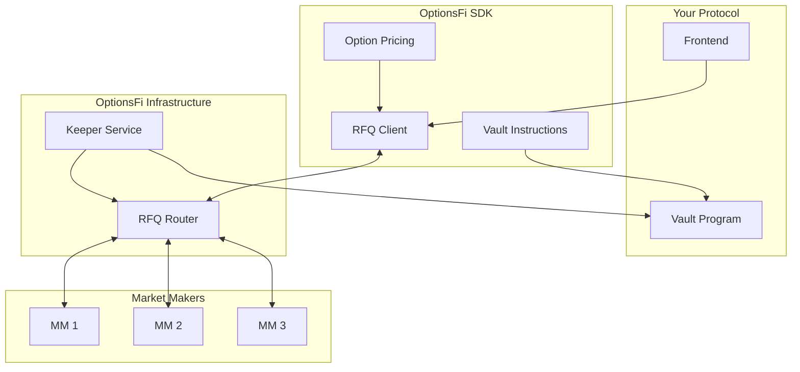
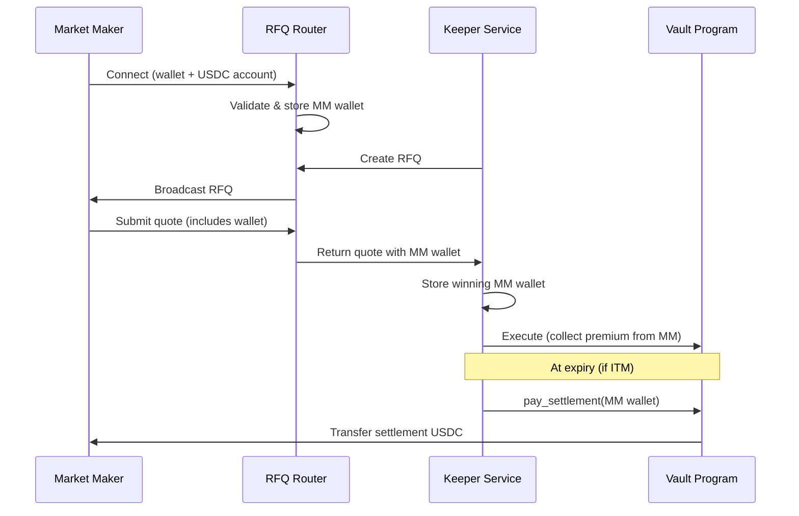

## System Overview

OptionsFi consists of three main components that work together to enable on-chain options settlement:



## Components

### SDK Components

<AccordionGroup>
  <Accordion title="RFQ Client" icon="plug">
    The RFQ Client handles all communication with the RFQ Router via WebSocket:
    
    - **Connect/Disconnect** - Manage WebSocket connection
    - **Create RFQ** - Submit new requests for quotes
    - **Subscribe to Quotes** - Receive real-time quotes from market makers
    - **Execute Options** - Accept a quote and trigger on-chain execution
    
    ```typescript
    import { RFQClient, DEVNET_CONFIG } from '@optionsfi/sdk';
    
    const client = new RFQClient(DEVNET_CONFIG);
    await client.connect();
    ```
  </Accordion>
  
  <Accordion title="Vault Instructions" icon="landmark">
    Build Solana transactions for the vault program:
    
    - **Fetch Vault Data** - Read on-chain vault state
    - **Record Exposure** - Track notional exposure after RFQ fill
    - **Collect Premium** - Transfer premium from market maker
    - **Pay Settlement** - Handle ITM option settlement
    
    ```typescript
    import { VaultInstructions } from '@optionsfi/sdk';
    
    const vaultIx = new VaultInstructions(connection);
    await vaultIx.initialize();
    const vault = await vaultIx.fetchVault('NVDAX');
    ```
  </Accordion>
  
  <Accordion title="Option Pricing" icon="calculator">
    Black-Scholes pricing and utilities:
    
    - **Fair Value Calculation** - Price calls and puts
    - **Greeks** - Delta calculation for risk management
    - **Quote Validation** - Ensure quotes are within fair value bounds
    - **Implied Volatility** - Derive IV from market prices
    
    ```typescript
    import { OptionPricing } from '@optionsfi/sdk';
    
    const price = OptionPricing.blackScholes({
      spot: 145, strike: 150,
      timeToExpiry: 7/365,
      riskFreeRate: 0.05,
      volatility: 0.45
    });
    ```
  </Accordion>
</AccordionGroup>

### Infrastructure Components

<AccordionGroup>
  <Accordion title="RFQ Router" icon="route">
    The RFQ Router is a hosted service that:
    
    - Receives RFQ requests from vaults
    - Broadcasts RFQs to connected market makers
    - Aggregates quotes and streams them back
    - Notifies winning market makers on fill
    
    **WebSocket Endpoint**: `wss://rfq.optionsfi.xyz`
  </Accordion>
  
  <Accordion title="Keeper Service" icon="robot">
    The Keeper automates vault lifecycle:
    
    - Fetches real-time prices from Pyth oracles
    - Calculates optimal strikes (typically 5% OTM)
    - Triggers RFQs at epoch boundaries
    - Handles premium collection and settlement
    
    This runs automatically for managed vaults.
  </Accordion>
</AccordionGroup>

## Data Flow

### RFQ Lifecycle

<Steps>
  <Step title="Create RFQ">
    Your vault creates an RFQ specifying the option parameters (asset, strike, expiry, quantity)
  </Step>
  <Step title="Broadcast">
    The RFQ Router broadcasts to all connected market makers
  </Step>
  <Step title="Quote">
    Market makers analyze the RFQ and submit premium quotes
  </Step>
  <Step title="Validate">
    Your vault validates quotes against Black-Scholes fair value
  </Step>
  <Step title="Execute">
    Accept the best quote and execute the on-chain transaction
  </Step>
  <Step title="Settle">
    At expiry, the keeper settles ITM options automatically to the actual MM wallet
  </Step>
</Steps>

### Settlement System

The platform tracks market maker wallets throughout the RFQ lifecycle:



**Key Features:**
- ✅ MM wallets validated on connection
- ✅ All quotes include MM wallet addresses
- ✅ Winning MM tracked throughout position lifecycle
- ✅ ITM settlements paid to actual MM (not intermediaries)
- ✅ Whitelist validation enforced on-chain

## Vault Account Structure

The on-chain vault stores:

| Field | Type | Description |
|-------|------|-------------|
| `authority` | `PublicKey` | Admin/authority address |
| `assetId` | `string` | Asset identifier (e.g., "NVDAX") |
| `underlyingMint` | `PublicKey` | Token mint for underlying |
| `shareMint` | `PublicKey` | Vault share token mint |
| `totalAssets` | `u64` | Total underlying in vault |
| `totalShares` | `u64` | Outstanding shares |
| `epoch` | `u64` | Current epoch number |
| `epochNotionalExposed` | `u64` | Notional under option exposure |
| `epochPremiumEarned` | `u64` | Premium earned this epoch |
| `utilizationCapBps` | `u16` | Max utilization (basis points) |
| `isPaused` | `bool` | Emergency pause flag |

## Security Model

<CardGroup cols={2}>
  <Card title="Authority Control" icon="key">
    All sensitive operations require authority signature
  </Card>
  <Card title="Utilization Caps" icon="gauge">
    Vaults can limit maximum exposure percentage
  </Card>
  <Card title="Timelock Parameters" icon="clock">
    Parameter changes require 24-hour timelock
  </Card>
  <Card title="Market Maker Whitelist" icon="list-check">
    Only approved market makers can submit quotes
  </Card>
</CardGroup>

## Networks

| Network | RPC | Program ID |
|---------|-----|------------|
| Devnet | `https://api.devnet.solana.com` | `A4jgqct3bwTwRmHECHdPpbH3a8ksaVb7rny9pMUGFo94` |
| Mainnet | `https://api.mainnet-beta.solana.com` | `A4jgqct3bwTwRmHECHdPpbH3a8ksaVb7rny9pMUGFo94` |
