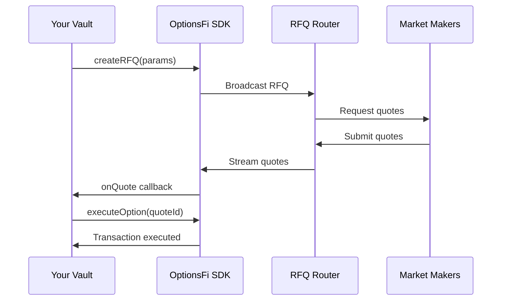

## What is OptionsFi?

OptionsFi is the **settlement and pricing layer for on-chain options** on Solana. We connect DeFi protocols to professional market makers via RFQs (Request for Quote), enabling institutional-grade options infrastructure for any vault strategy.

### Key Benefits

<CardGroup cols={2}>
  <Card title="Real Premiums" icon="dollar-sign">
    Get competitive options premiums from professional market makers instead of arbitrary yield rates
  </Card>
  <Card title="No Slippage" icon="check">
    Deterministic on-chain execution with quote-locked pricing ensures predictable outcomes
  </Card>
  <Card title="Modular Design" icon="puzzle-piece">
    Works with any vault strategy - covered calls, puts, or custom structured products
  </Card>
  <Card title=\"Transparent Pricing\" icon=\"chart-line\">
    Black-Scholes pricing utilities and Pyth oracle integration for fair value validation
  </Card>
  <Card title=\"Production-Ready Settlements\" icon=\"check-circle\">
    Complete settlement tracking from quote to ITM payout with MM wallet validation
  </Card>
</CardGroup>

## How It Works

## Use Cases

<CardGroup cols={2}>
  <Card
    title="Covered Call Vaults"
    icon="arrow-trend-up"
    href="/examples/covered-call-vault"
  >
    Earn premium by selling calls on deposited assets like SOL, ETH, or tokenized stocks
  </Card>
  <Card
    title="Put-Selling Strategies"
    icon="shield-halved"
    href="/guides/creating-rfqs"
  >
    Generate yield by selling cash-secured puts on assets you want to accumulate
  </Card>
  <Card
    title="Structured Products"
    icon="layer-group"
    href="/guides/vault-integration"
  >
    Build collars, spreads, and exotic payoffs using the SDK primitives
  </Card>
  <Card
    title="Treasury Management"
    icon="building-columns"
    href="/guides/vault-integration"
  >
    Optimize DAO treasury yield with institutional options strategies
  </Card>
</CardGroup>

## Quick Links

<CardGroup cols={3}>
  <Card title="Quickstart" icon="rocket" href="/quickstart">
    Get started in 5 minutes
  </Card>
  <Card title="API Reference" icon="code" href="/api-reference/overview">
    Explore the SDK API
  </Card>
  <Card title="GitHub" icon="github" href="https://github.com/feeniks01/optionsfi">
    View source code
  </Card>
</CardGroup>
